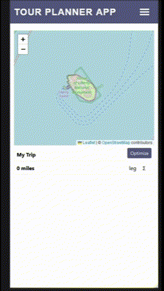
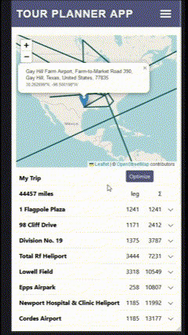

# Trip Planner Web App
### Ayush Adhikari
#### Originally a part of CS314: Software Engineering at Colorado State University
<hr>

TODO description

## Mobile Display
```
Adding places to the tour using the map
```

Adding places to the map using name or coordinates and filtering by country or type




## Window Display


## Project Structure
```
This package includes the following files.
|--bin  
    |--clean-local-cache.sh[]  
    |--run.sh[]  
|--client  
    |--schemas[]  
    |--src[]  
    |--templates[]  
    |--test[]  
    |--package.json[]  
    |--webpack.config.js[]  
|--Postman  
    |--base.json[]  
    |--config.json[]  
    |--distances.json[]  
    |--find.json[]  
    |--near.json[]  
    |--tour.json[]  
|--server  
    |--src  
        |--main  
            |--java/com/tco  
                |--misc[]  
                |--requests[]  
                |--server[]  
            |--resources/schemas  
        |--test/java/com/tco  
            |--misc[]  
            |--requests[]  
            |--server[]  
    |--pom.xml[config file used for maven]  
|--static[used for the two videos used for this markdown]  
|--locations_db.sql[a dump file that can be used to recreate a database with all places used in the app]  
|--README.md[this file]  
```

### Tools Utilized
- Java
- JavaScript
- ReactJS
- Postman
- GitHub (Workflows, VC, Coverage, Testing, Automation, Releases)
- Code Climate
- JUnit
- Maven
- MariaDB

