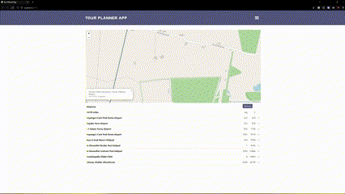
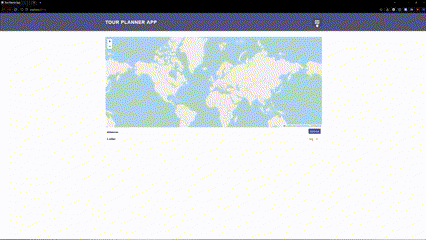
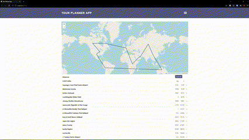

# Trip Planner Web App
### Ayush Adhikari
#### Originally a part of CS314: Software Engineering at Colorado State University
<hr>

This app was built using Java Spark and Maven for the back-end and React and npm for the front-end. It was deployed to GitHub for releases, automation, workflows, and version control. It is an app that helps users build tours, whether for work or a vacation. Places can be added using the map or the add places button, both explained in detail in the belowe sections. These will appear as their names and display their coordinates in the list below the map. The app also allows you to optimize the tour so there are no overlapping lines and the trip can be efficient. The first location is the starting city and will also be the ending city so the distances are calculated using modulo so the last leg distance is between the last place and the first one. The tests were created using JUnit for unit testing, Jacoco and Jest for coverage testing, and Postman for integration testing. 

## Functionalities
For a detailed look at all of these funcationalities, please look below at the Mobile UI and Window UI sections. The first will show the mobile UI and all of the functionalities, and the latter will show the same in a windowed format. However, this app was made with mobile-first design in mind. If you hover over the gifs, you can see a text box explaining what they are showcasing. These are sped up and are fairly low quality as they are a gif. Using the app, you can do the following:
1) Using the menu, you can see the **about** page, which is a page with includes a picture and description of the developer, me.
2) Using the menu, you can **add places** to the map. These will show a list of 7 initial places, but you can search for specific locations using the search bar. Entering a string here will match it against all fields in the database and return the relevant results. If a coordinate was entered in the form of '-30, 180' or '50n, 40e', it will match against the coordinates in the database. All places are within a 50 mile radius and sorted by their proximity to the coordinate entered. In the bottom, there are two dropdown menus. In the left, you can select the type of place it is; these include airport, heliport, balloonport, other, or all types. Choosing one of these will filter the results to places that are identified as such in the database. The second dropdown will allow you to choose a country from a list of all countries. These will filter the results to only that country or all countries.
3) Using the menu, you can **load places** using a json file that defines the the coordinates and names. The schema for this coordinate can be found under server/src/main/resources/schema/distances.json. If valid, they will be loaded into the map with the total distance displayed under the map and the leg distance for all places from one to the next. The map will show all of these places as well as the lines from the start to the finish then to the start.
4) Using the menu, you can **save the current trip** in json or kml formats. These include all of the palces in the current map and can be imported into Google Earth, this app, or another one.
5) Using the menu, you can remove all of the places from the map. This will allow you to quickly remove all places rather than going through each individual one.
6) In the map, you can zoom in and out and click on places to add that to the current trip. When clicking on a place, it will appear below the map and update the total distance of the tour. Clicking on the newly added place will give you the option to see the details (name, coordinates) and delete it from the map. The leg distance corresponds to the distance from the place above it to it. It is sequential.
7) Below the map, you can see a green optimize button. This will optimize the tour that is currently planned so there are no overlapping lines using heuristic TSP algorithms. The main purpose of this is to make the trip as efficient as possible. If you selected 20 places, you want to be able to start at the starting location and go to each place without having to overlap you past visits and then end of at the starting location again. The three algorithm used are Nearest Neighbor, 2Opt, and 3Opt. These are calculated using a function to anticipate how long the optimization will take with all places. If the expected time is more than a second, which was arbritary and can be changed in the request or server, it will default to an algorithm that is less computationally expensive. Therefore, this leads to: 3opt for ~100 places or less, 2opt for ~100 to ~500, Nearest Neighbor for ~500 to ~1200, and anything after that is returned without any optimizations. So, on the machine tested, the most number of optimizations possible was 1200 in under a second. If the tour is empty, the optimize button will not do anything. All distance calculations between coordinates are done using the Vincenty great circle distance formula by default.

## Mobile UI
<div style='display: flex;'>
    
    
    
    
</div>


## Window UI
<div style='display: flex'>
    
    
    
    
    
</div>

## Project Structure
```
This package includes the following files.
|--bin  
    |--clean-local-cache.sh[]  
    |--run.sh[]  
|--client  
    |--schemas[]  
    |--src[]  
    |--templates[]  
    |--test[]  
    |--package.json[]  
    |--webpack.config.js[]  
|--Postman  
    |--base.json[]  
    |--config.json[]  
    |--distances.json[]  
    |--find.json[]  
    |--near.json[]  
    |--tour.json[]  
|--server  
    |--src  
        |--main  
            |--java/com/tco  
                |--misc[]  
                |--requests[]  
                |--server[]  
            |--resources/schemas  
        |--test/java/com/tco  
            |--misc[]  
            |--requests[]  
            |--server[]  
    |--pom.xml[config file used for maven]  
|--static[used for the two videos used for this markdown]  
|--locations_db.sql[a dump file that can be used to recreate a database with all places used in the app]  
|--README.md[this file]  
```

### Tools Utilized
- Java
- JavaScript
- ReactJS
- Postman
- GitHub (Workflows, VC, Coverage, Testing, Automation, Releases)
- Code Climate
- JUnit
- Maven
- MariaDB

